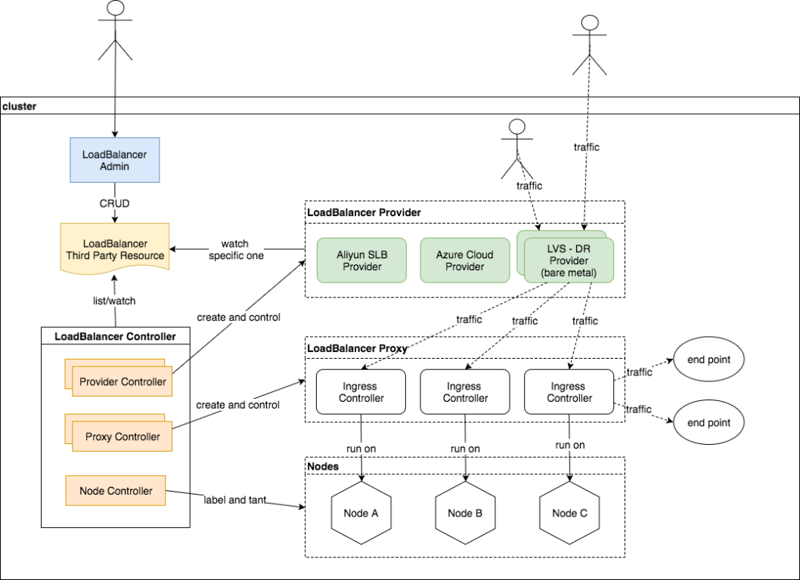
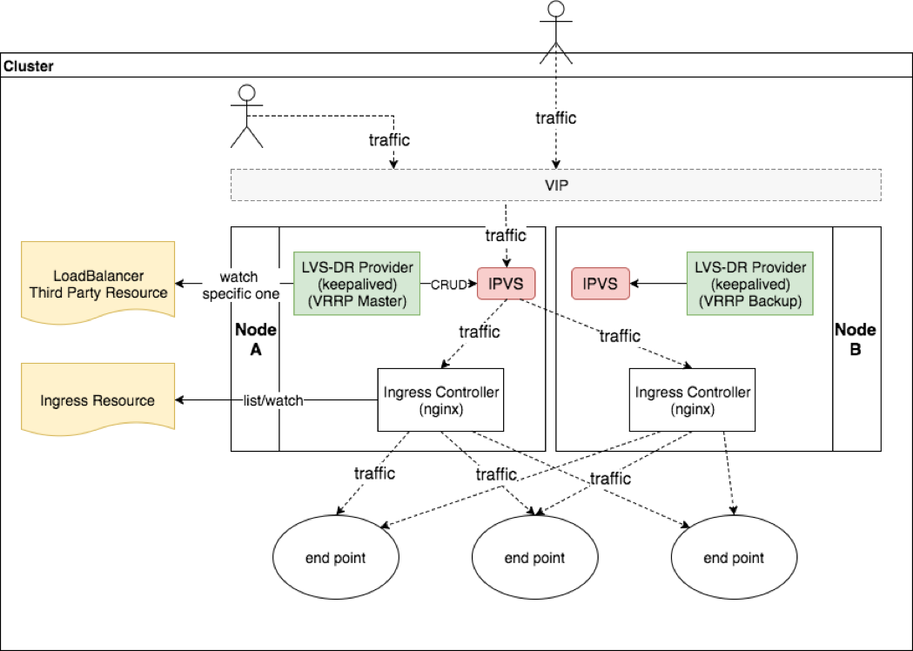
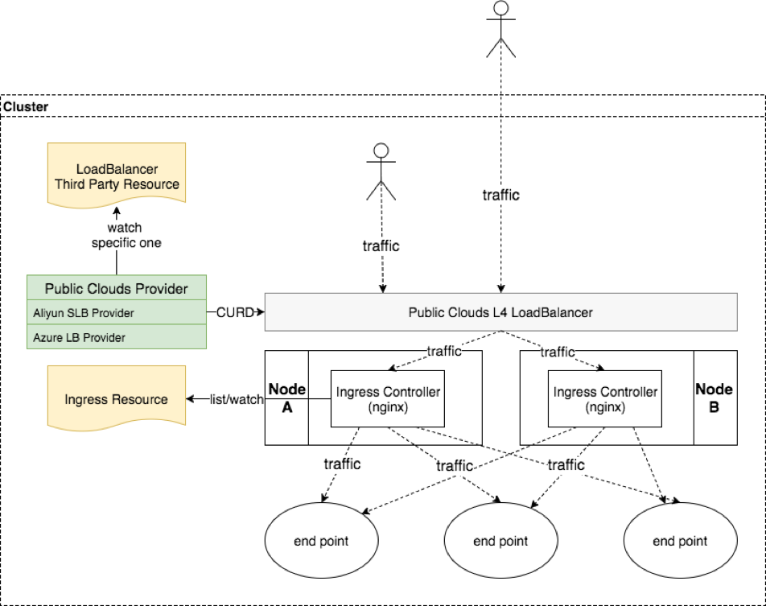

## Design

### Controller

In this architecture,  we introduce a new `Third Party Resource - LoadBalancer` to specify the desired behavior of the `LoadBalancer`.

You can operate the `LoadBalancer TPRs` through custom LoadBalancer Admin via  RESTful api or `kubernetes apiserver` directly via kubectl or client-go.

Then `LoadBalancer Controller` will list/watch the `LoadBalancer TPRs`, create and control the `Provider` and `Proxy` , label and taint the selected nodes according to the specification.

In Bare metal, we run LVS providers on DR mode beside each proxy to provide a highly available vip.

In Public Clouds, we run an specific provider to adapt the public cloud's L4 loadbalancer.

### Bare Metal

In Bare Metal, we choose LVS/DR mode as provider. All the following will be settled automatically.

-   we let ingress controller run on host network
-   on DR mode, we need to modify sysctl setting to let `arp_ignore=1`, `arp_announce=2`
-   add VIP to loopback device
-   use fwmark to distinguish the traffic to avoid infinite loop beween two lvs director peer
-   use keepalived to guarantee high available vip

### Public Clouds

In Public Clouds, we run a specific provider to adapt public clouds' L4 load balancer.

the provider CRUD the rules of  public clouds' load balancer to let traffic in.
